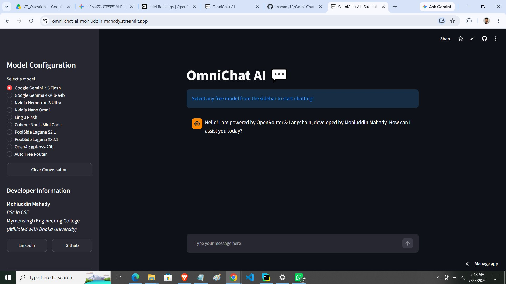

# 💬 OmniChat AI

A modern multi-model AI chatbot built with **Streamlit**, **LangChain**, and **OpenRouter**. OmniChat AI allows users to chat with multiple free Large Language Models (LLMs) through a clean and responsive web interface.

> Switch between different AI models instantly without changing your application.

---

## Preview

| Chat Interface             |
|----------------------------|
|  |
---

## ✨ Features

- 🤖 Chat with multiple free AI models
- 🔄 Switch models instantly from the sidebar
- 💬 Persistent conversation history
- 🧠 Context-aware responses using LangChain
- ⚡ Streaming responses (real-time token generation)
- 🗑️ One-click conversation reset
- 🎨 Clean and responsive Streamlit interface
- 🔐 Secure API key management using environment variables

---

## Tech Stack

- **Python**
- **Streamlit**
- **LangChain**
- **OpenRouter API**
- **OpenAI Compatible API**
- **python-dotenv**

---

## Supported Models

The application currently supports:

- Google Gemini 2.5 Flash
- Google Gemma 4 26B
- Nvidia Nemotron 3 Ultra
- Nvidia Nano Omni
- InclusionAI Ling 3 Flash
- Cohere North Mini Code
- Poolside Laguna S2.1
- Poolside Laguna XS2.1
- OpenAI GPT-OSS-20B
- OpenRouter Free Auto Router

Since the application uses OpenRouter, adding new models only requires inserting the model ID into the dictionary.

---

## Project Structure

```
OmniChat-AI/
│
├── app.py
├── .env
├── requirements.txt
├── README.md
└── images/
    ├── chat.png
```

---

## Installation

### 1. Clone the repository

```bash
git clone https://github.com/your-username/OmniChat-AI.git
```

```bash
cd OmniChat-AI
```

---

### 2. Create a virtual environment (Optional)

**Windows**

```bash
python -m venv venv
venv\Scripts\activate
```

**Linux / macOS**

```bash
python3 -m venv venv
source venv/bin/activate
```

---

### 3. Install dependencies

```bash
pip install -r requirements.txt
```

---

### 4. Get an OpenRouter API Key

Create an account at:

https://openrouter.ai/

Generate an API key from your dashboard.

---

### 5. Create a `.env` file

```env
OPENROUTER_API_KEY=your_api_key_here
```

---

### 6. Run the application

```bash
streamlit run app.py
```

---

## How It Works

1. The user selects an AI model from the sidebar.
2. The selected model is loaded through OpenRouter.
3. LangChain builds a prompt using:
   - Previous conversation history
   - Current user message
4. The response is streamed back in real time.
5. The conversation is stored in Streamlit Session State, allowing the chatbot to maintain context throughout the session.

---

## 🔒 Environment Variables

| Variable | Description |
|----------|-------------|
| `OPENROUTER_API_KEY` | Your OpenRouter API key |

---

## Requirements

```
streamlit
langchain
langchain-openai
python-dotenv
openai
```

or simply

```bash
pip install -r requirements.txt
```

---

## Future Improvements

- Chat export (PDF / TXT)
- Conversation search
- File upload support
- Retrieval-Augmented Generation (RAG)
- Multi-agent workflow using LangGraph

---

## 👨‍💻 Developer

**Mohiuddin Mahady**

B.Sc. in Computer Science & Engineering  
Mymensingh Engineering College  
(Affiliated with the University of Dhaka)

**LinkedIn**

https://www.linkedin.com/in/mohiuddin-mahady/

**GitHub**

https://github.com/mahady13

---

## ⭐ If you found this project helpful...

Consider giving the repository a **⭐ Star**. It helps others discover the project and motivates future development.

---

## 📄 License

This project is licensed under the **MIT License**.

Feel free to use, modify, and distribute it for personal or educational purposes.